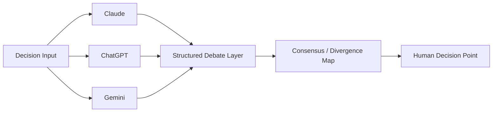

# AI Council

Three models, one decision. Claude, ChatGPT, and Gemini argue it out before I act on it.

## Why I built this

Every "ask an AI" tool I'd used picked one model and trusted its answer. That bothered me — a single model can sound confident and still be wrong, and it has blind spots specific to its own training that you'd never catch by asking it twice. I wanted to see what happens if you make three different models disagree with each other before a decision gets made, instead of trusting any one of them alone.

## How it works

Each model gets the same input independently — no seeing each other's answers first. Then their outputs get compared: where they agree, that's a stronger signal; where they diverge, that's flagged explicitly rather than averaged away or hidden. I make the final call with the full disagreement map in front of me, not just a single answer.

## Where this started

I originally built this for trading decisions, as part of my [Trading Automation Stack](https://github.com/vickybansal99-tech/trading-automation-stack) — I wanted a second and third opinion before acting on any real-money call. The framework turned out to be useful well beyond trading, so I pulled it out as its own thing.

## Status

Personal build, actively used for my own decisions. Not a product, not for sale, no roadmap — just a tool I built because I wanted it to exist.
