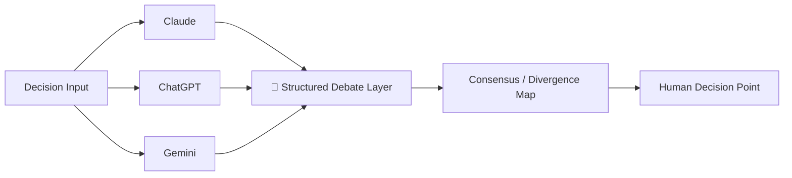

# 🤝 AI Council

**A multi-AI decision framework — structured debate between frontier models before high-stakes decisions are made.**

  

---

## 🧭 Overview

Most AI-powered decision tools pick one model and trust it. AI Council is built on a different premise: **structured disagreement between multiple frontier models produces better decisions than any single model alone**.

The framework puts Claude, ChatGPT, and Gemini into a structured dialogue over a decision — surfacing where they agree, where they diverge, and why — before a final call is made. Originally built for trading decisions, it's applicable to any high-stakes domain where a second (and third) opinion matters.

---

## 🧠 How It Works

1. **Input** — a decision, scenario, or question is submitted
2. **Independent analysis** — each model analyses it separately, without seeing the others' output
3. **Structured debate** — outputs are compared; agreements are noted, divergences are surfaced with reasoning
4. **Decision point** — the human sees the full map of where models agree and disagree before deciding

---

## 💡 Why This Exists

Single-model AI outputs suffer from two failure modes:
- **Hallucination confidence** — wrong answers delivered with certainty
- **Blind spots** — systematic gaps in one model's training or reasoning

Structured multi-model debate catches both: if three models disagree on a conclusion, that's a signal to investigate further before acting.

---

## 🔗 Related

Originally built as part of the [Trading Automation Stack](https://www.vickybansal.com) — the multi-AI decision engine for trading decisions across US and Indian markets.

---

*Personal build — architecture and framework design by Vicky Bansal.*
